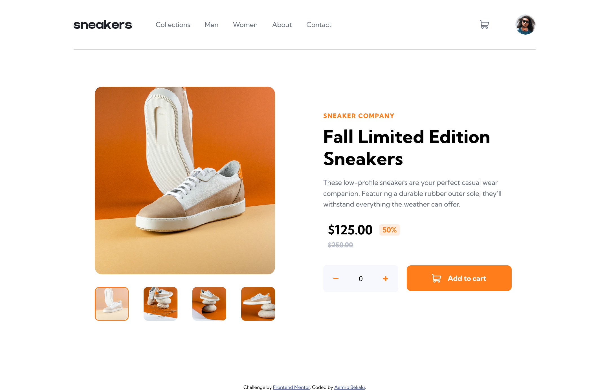
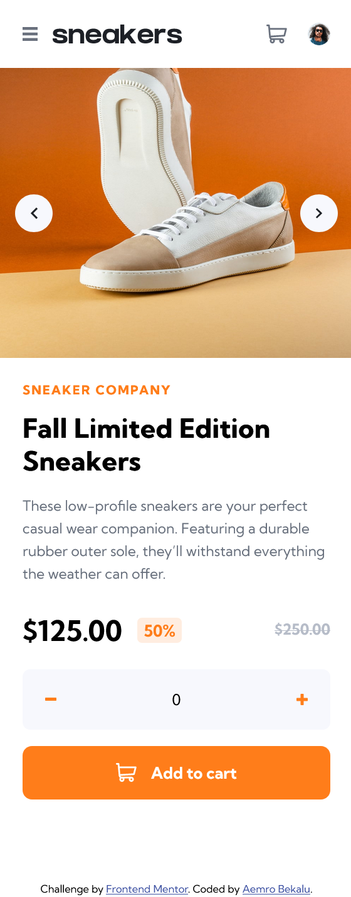

# Frontend Mentor - E-commerce product page solution

This is a solution to the [E-commerce product page challenge on Frontend Mentor](https://www.frontendmentor.io/challenges/ecommerce-product-page-UPsZ9MJp6). Frontend Mentor challenges help you improve your coding skills by building realistic projects.

## Table of contents

- [Overview](#overview)
  - [The challenge](#the-challenge)
  - [Screenshot](#screenshot)
  - [Links](#links)
- [My process](#my-process)
  - [Built with](#built-with)
  - [What I learned](#what-i-learned)
  - [Continued development](#continued-development)
  - [Useful resources](#useful-resources)
- [Author](#author)

## Overview

### The challenge

Users should be able to:

- View the optimal layout for the site depending on their device's screen size
- See hover states for all interactive elements on the page
- Open a lightbox gallery by clicking on the large product image
- Switch the large product image by clicking on the small thumbnail images
- Add items to the cart
- View the cart and remove items from it

### Screenshot

-desktop view


-mobile view


### Links

- Solution URL: [Add solution URL here](https://your-solution-url.com)
- Live Site URL: [Add live site URL here](https://your-live-site-url.com)

## My process

### Built with

- Semantic HTML5 markup
- CSS custom properties
- Flexbox
- CSS Grid
- Mobile-first workflow
- javascript

### What I learned

in this challenge I have learned how can I add different css styles or made changes on the dom in different screen width from javascript.
the thing which you have to do to change the css styles for the different screen width is using the event listeners for the window resize and load event and when these event listened read the screen width and add a mofication like you want for the different screen sizes but this time we have to use the if statement only (not else if) to target these screen sizes.
for example:-

```js
//addEventListener for the load and resize event on the window
function addEvent(eventName, callback) {
  window.addEventListener(eventName, callback);
}

//event handler for the above events
const changeCssClasses = function () {
  const screenWidth = window.innerWidth;
  //when the screen size is above 820
  if (screenWidth >= 820) {
    thumnailImagesContainer.forEach((container) => {
      container.classList.remove("hidden");
    });

    arrowBtns.forEach((btn) => {
      btn.classList.add("hidden");
    });
  }

  //when the screen size is above 1100
  if (screenWidth >= 1100) {
    navList.classList.remove("move-to-the-left");

    buttonsInsideLightBox.forEach((arrowBtn) => {
      arrowBtn.classList.remove("hidden");
      arrowBtn.style.top = `calc(${lightboxImageList.offsetHeight / 2}px )`;
    });
  }
};

addEvent("load", changeCssStyle);
addEvent("resize", changeCssStyle);
```

in the above code we can add different styles to the screen width above 820px and 1100px using the if statement but if we use the else if statement the styles which is applied for the screen width above 1100px won't be applied because it got targeted first in the first if statement.

### Continued development

I will continue to do project which involve js and do problem solving challenges involve js on the competetive websites

## Author

- Frontend Mentor - [@aemrobe](https://www.frontendmentor.io/profile/aemrobe)
- Twitter - [@Aemro112](https://www.twitter.com/Aemro112)
